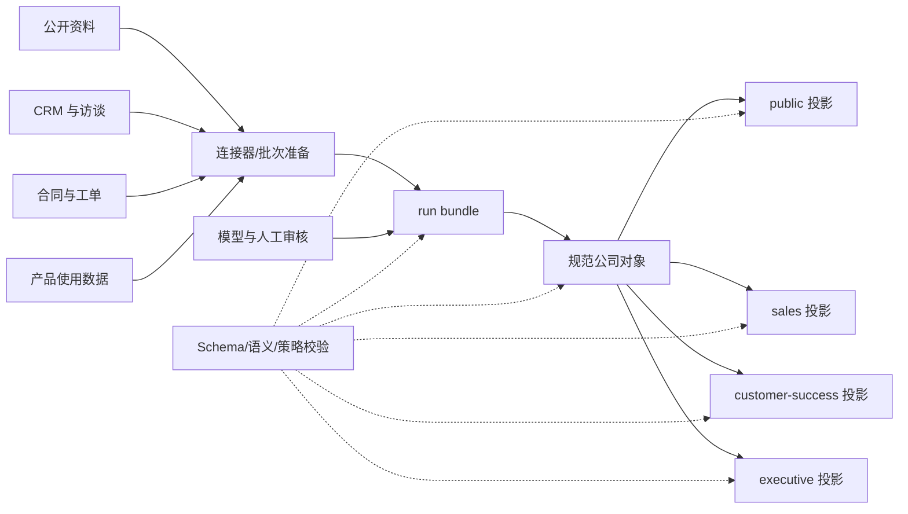
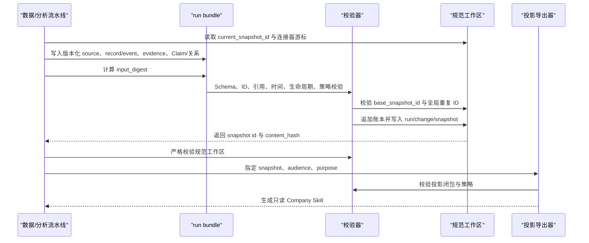

# Company Distiller 概要设计

## 1. 设计目标

Company Distiller 的目标不是生成一篇静态公司报告，而是把“公司”建模为可持续蒸馏的版本化证据系统：公开资料、CRM、访谈、合同、工单和产品使用数据可以分批进入；每轮运行保留输入版本、证据链、审核结论、冲突和变化；同一规范快照可按受众和用途导出不同的 Company Skill。

核心设计目标如下：

- 保留企业内部结构化数据的原始语义，避免先压成散文再分析；
- 把事实、陈述、观察、推断、假设、风险和义务明确区分；
- 同时表达业务有效时间和系统观察/入库时间；
- 通过追加式账本、run、snapshot 和 change 支持重复运行、审计与确定性重放；
- 通过策略继承和白名单投影降低跨受众泄漏；
- 让交付 Skill 可追溯到 Claim、evidence、record/event、source 和 run。

## 2. 非目标

当前参考实现不负责：

- 直接连接 CRM、合同库、工单系统、数据仓库或模型服务；
- 训练或实现通用本体推理引擎、向量检索系统或知识图数据库；
- 提供 Web UI、人工审核工作流、作业编排和告警；
- 提供生产级事务、跨进程锁、租户隔离、认证授权、密钥管理和静态加密；
- 自动执行数据保留、删除请求、法律留置或地域合规；
- 证明生成答案真实、完整，或给出法律、投资、采购结论。

它提供的是数据契约、状态转移、治理投影、校验器和可执行示例，可作为生产系统的语义内核和验收基线。

## 3. 系统上下文



边界原则是“规范对象与交付视图分离”。JSONL 账本和 snapshot 是事实源；Markdown 和生成的 Skill 只是可重建投影。

## 4. 架构分层

| 层 | 主要对象 | 职责 |
|---|---|---|
| 输入版本层 | `source`、`run.input_digest`、`connector_cursors` | 固定上游版本、来源定位、内容哈希和增量游标 |
| 规范化层 | `entity`、`record`、`event` | 保留业务对象、结构化行和发生过的事件 |
| 证据层 | `evidence` | 提供可寻址最小证据单元，并连接 source/record/event |
| 语义层 | `claim`、`relation` | 表达有类型、有时间、有证据的断言和实体关系 |
| 治理层 | `policy` | 定义分类、受众、用途、个人数据、保留期和定位符导出规则 |
| 版本层 | `run`、`snapshot`、`change` | 记录每轮输入与产物，物化当前状态，分类增量变化 |
| 交付层 | `projection`、Company Skill | 按 audience/purpose 输出授权内容和安全 provenance stub |
| 质量层 | Schema、对象校验、Skill 校验、16 项验收 | 对各层实施结构、引用、时间、策略、泄漏与回归检查 |

这些层不是独立数据副本，而是一条可追溯依赖链。越靠后的对象必须保留对前层对象的稳定引用。

## 5. 目录与部署单元

### 5.1 规范公司对象

```text
company-object/
  manifest.json
  object/entities.jsonl
  sources/sources.jsonl
  records/records.jsonl
  events/events.jsonl
  evidence/index.jsonl
  claims/claims.jsonl
  relations/relations.jsonl
  governance/policies.json
  runs/runs.jsonl
  snapshots/index.jsonl
  changes/index.jsonl
  evals/test-prompts.json
```

`manifest.json` 保存公司标识和当前 snapshot 指针。各 JSONL 文件是追加式账本。`governance/policies.json` 当前是可变配置文件，不在 run 账本中版本化；这属于后续需要补齐的设计缺口。

### 5.2 run bundle

```text
run-bundle/
  run.json
  entities.jsonl
  sources.jsonl
  records.jsonl
  events.jsonl
  evidence.jsonl
  claims.jsonl
  relations.jsonl
```

bundle 是一次运行的完整输入边界。`input_digest` 对 `run.json`（摘要字段置空后）和各集合规范内容计算 SHA-256；每行 `created_by_run` 绑定该 bundle 的 run。

### 5.3 交付投影

投影包含 `projection.json`、生成的 `SKILL.md`、事实 Markdown、授权实体/Claim/证据/关系、来源索引、治理策略子集、评估提示和 provenance stub。它不包含规范 record/event 的原始 payload，也不是后续增量运行的输入。

## 6. 领域模型

### 6.1 三个相连但独立的域

| 域 | 典型实体 | 典型记录与信号 | 防止的错误归因 |
|---|---|---|---|
| `company` | 公司、法人、业务单元、站点、产品、市场、风险 | 公开事实、财务指标、公司事件 | 把卖方 CRM 状态写成公司属性 |
| `commercial_relationship` | account、role、opportunity、contract | CRM、访谈陈述、合同条款 | 把商机阶段当意愿，把合同当采用 |
| `product_use_service` | subscription、product、ticket、metric | 授权、使用聚合、工单、服务事件 | 把使用量当满意度，把单个工单当系统性缺陷 |

实体 ID 稳定，角色与人员分开，卖方账户与目标公司分开，合同、订阅和实际使用分开。跨域联系使用有证据的 `relation`，而不是复制或合并对象。

### 6.2 Claim

Claim 是最重要的知识单元，包括：

- `subject_id`、`predicate`、类型化 `value` 和 `scope`；
- `claim_type` 与 `decision`，区分知识类型和审核状态；
- `valid_from` / `valid_to` 与 `observed_at`；
- `evidence_ids` 和四维 `confidence`；
- `supersedes`、`contradicts` 生命周期链接；
- `policy_id` 和 `created_by_run`。

Claim 不可变。更正、强化、撤回和冲突都创建新 Claim，不改历史行。`confidence` 不能替代审核决策或访问策略。

### 6.3 Evidence 与 provenance

Evidence 是可定位的最小证据单元，可直接来自 source/record/event，也可通过 `derived_from` 引用其他 evidence。系统要求派生图无环。结构化记录保留在 record 账本，evidence 只提供地址、摘要和引用，避免把 CRM、合同或遥测压缩成不可计算的纯文本。

## 7. run 生命周期



正常状态转换如下：

1. 初始 run 的 `base_snapshot_id` 为 `null`；
2. 增量 run 必须基于 manifest 的当前 snapshot，旧基线被拒绝；
3. 所有结构和语义检查通过后才开始写入；
4. 新行追加到各规范账本；
5. 依据 Claim 生命周期物化 snapshot 和 change；
6. manifest 指向新 snapshot；
7. 投影从指定 snapshot 独立生成。

同一有序 bundle 序列在干净工作区重放，应得到相同的最终 snapshot `content_hash`。

## 8. 快照与变更模型

Snapshot 不复制全部对象，只保存以下集合的 ID：

- 当前有效 Claim：`active_claim_ids`；
- 尚未解决的冲突 Claim：`conflict_claim_ids`；
- 撤回记录：`retraction_claim_ids`；
- 当前有效关系：`active_relation_ids`。

新 Claim 的状态转移规则：

| 条件 | 变更 | 状态处理 |
|---|---|---|
| 无链接且语义不重复 | `new` | 加入 active |
| `supersedes` 且新旧语义签名相同 | `reinforced` | 替换旧 active |
| `supersedes` 且语义不同 | `superseded` | 替换旧 active/conflict |
| 存在 `contradicts` | `conflicted` | 新旧 Claim 进入 conflict |
| `decision` 为 `retracted` | `retracted` | 被指向 Claim 退出，撤回记录进入 retraction |
| `proposed` 或 `rejected` | `unchanged` | 只留审计账本，不进入 snapshot |

其中 `unchanged` 同时承载 proposed/rejected 是当前实现的技术分类，不等于二者业务含义相同。关系目前只有追加到 active 的路径，没有更正、失效、冲突和撤回的完整生命周期。

Snapshot 哈希覆盖父 snapshot ID、有效/冲突/撤回 Claim 内容和有效关系内容。它支持确定性重放检查，但当前不覆盖 entity、evidence、source、record、event、policy 的完整内容。

## 9. 策略继承与投影

分类顺序固定为：

```text
public < internal < confidential < restricted
```

派生对象的策略必须至少与所有依赖对象同等严格：分类不能降低，`allowed_audiences` 和 `allowed_purposes` 只能取更小集合。Claim 和 relation 继承 evidence 限制；evidence 继承 source/record/event；record/event 还受主体实体约束。

导出采用白名单模型。只有 audience、purpose、主体实体和对象策略均允许的当前 Claim/关系才进入投影；为解释生命周期，可加入同样获授权的历史 Claim。Evidence 的 `derived_from` 会递归闭包，相关 record/event 只导出无 `data` 和 subject 的 provenance stub。非公开定位符按策略遮蔽。

冲突投影遵循“可见内容不越权，但不能伪装无冲突”：受众只能看到授权的冲突方；`redacted_conflict_count` 表示存在被策略隐藏的替代项。

## 10. 校验与验收设计

### 10.1 分层校验

- bundle 校验：JSON Schema、摘要、run 归属；
- 应用前校验：公司、基线、全局 ID 唯一性；
- 全状态校验：引用闭包、时间顺序、证据无环、语义必需字段、生命周期、策略继承、snapshot 哈希和 manifest 一致性；
- 投影校验：文件完整性、Schema、ID 集合、引用、授权边界、provenance stub、占位符和 Markdown 表格；
- 回归验收：从零重建示例，执行 G01-G16。

### 10.2 验收覆盖

16 项门禁覆盖包结构、Schema、内部数据保真、provenance closure、实体范围、双时间、增量基线、不可变历史、六种变更、确定性重放、策略继承、投影隔离、四个固定测试哨兵、严格负例、运行时回答规则和单元/集成测试。

该验收主要证明参考实现的结构和确定性，不直接衡量实体消歧准确率、抽取召回率、推断质量、答案正确率或业务收益。生产评估还需盲测集、人工一致性、泄漏攻击测试和下游业务指标。

## 11. 关键实现约束与已知限制

| 限制 | 影响 |
|---|---|
| 本地多文件 JSONL，无数据库事务 | 校验失败可在写入前拒绝，但进程在多文件追加中崩溃时可能留下部分写入 |
| 无跨进程锁 | 两个进程可能同时通过同一 `base_snapshot_id` 检查；当前门禁只验证顺序运行下的过期基线 |
| policy 不随 run/snapshot 版本化 | 修改策略可能改变历史 snapshot 的后续导出结果，审计时无法仅凭 snapshot 还原当时策略 |
| snapshot 哈希只覆盖 Claim/关系状态 | 不能单独检测 evidence、source、entity、record/event 或 policy 内容被篡改 |
| projection 哈希以 ID 边界为主 | 不能替代对投影全部文件的签名或制品证明 |
| 关系只追加 | 无法完整表达关系终止、更正、冲突和撤回 |
| `retention_days` 仅为元数据 | 不会自动删除、归档或执行法律留置 |
| 本地策略不是文件访问控制 | 有文件系统权限的主体仍可读取规范原始数据 |
| 无实体解析和审核服务 | ID 合并、同名消歧、Claim 接受/拒绝需要外部流水线或人工流程 |
| 高频数据依赖外部聚合 | 参考实现不适合承载逐事件遥测和大规模查询 |

因此，“原子应用”“并发控制”“治理”在当前版本分别表示预写语义校验、乐观基线检查和投影过滤，不应被解释为数据库级原子事务、严格串行化或完整安全系统。

## 12. 演进建议

建议按以下顺序把参考实现演进为可运营系统：

1. 将账本、snapshot 和策略版本迁移到支持事务、唯一约束和乐观锁的数据库；大对象与原文进入加密对象存储；
2. 把 policy 作为版本化对象纳入 run 和 snapshot 哈希，增加租户、字段级规则、保留执行和审计日志；
3. 建立连接器与编排层，保存水位、重试、幂等键、死信和来源删除/更正事件；
4. 增加实体解析、Claim 候选审核、冲突裁决和下游推断重算队列；
5. 为 relation 增加与 Claim 对称的生命周期和双时间语义；
6. 扩大内容寻址范围，对 bundle、规范账本、snapshot 和投影制品建立签名或 Merkle 证明；
7. 将高频产品遥测留在分析仓库，只同步经定义、可复算的聚合和异常；
8. 在仓库外受控环境建立匿名化真实企业盲测集，分别测抽取、时效、证据引用、权限泄漏、跨轮一致性和业务任务效果；仓库只保存不可识别到企业的聚合结果。

演进过程中应保持现有 Schema 和投影接口的显式版本，避免把存储迁移与语义变更绑在同一次发布中。
